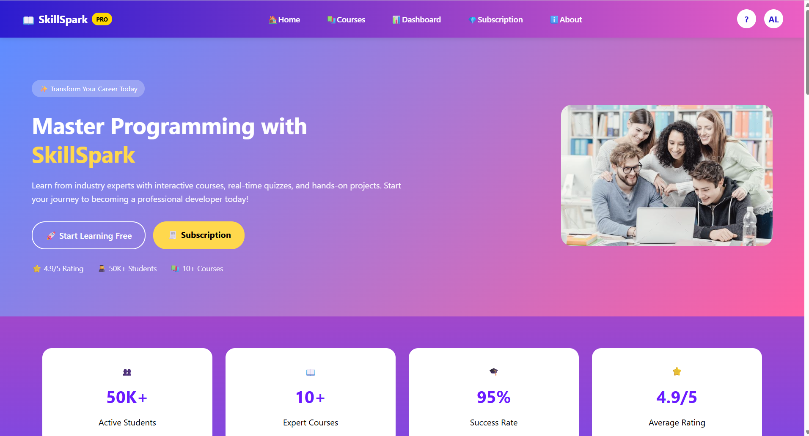
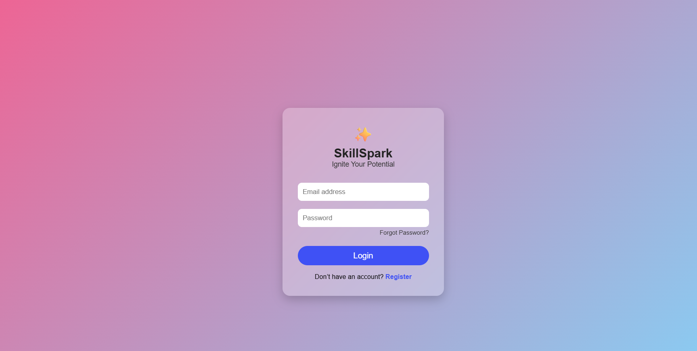
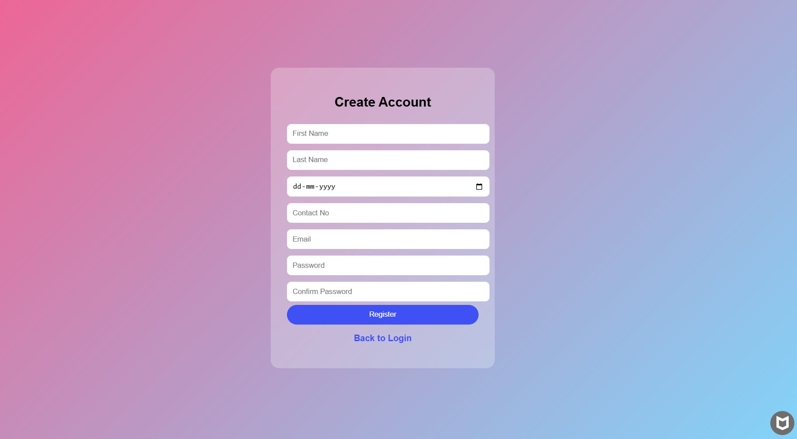
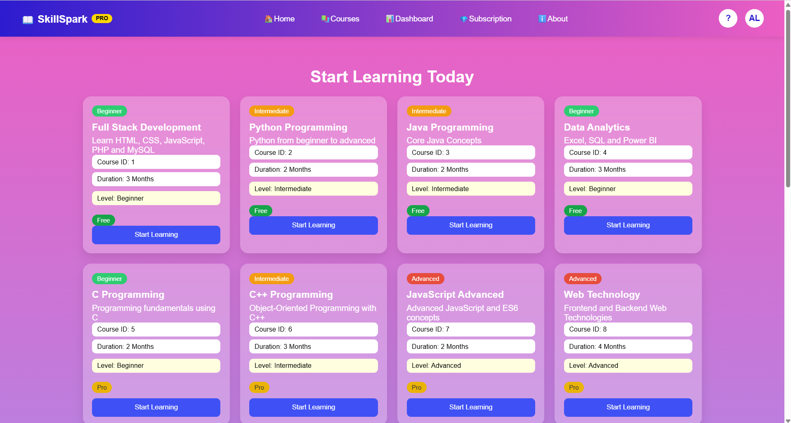
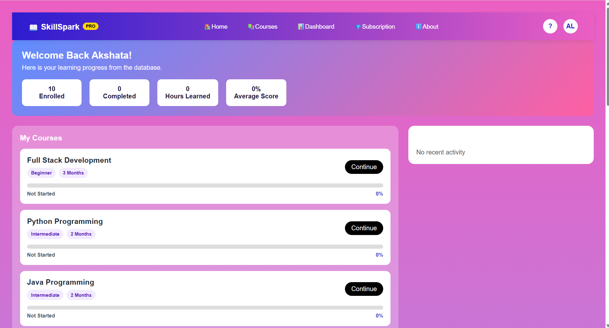
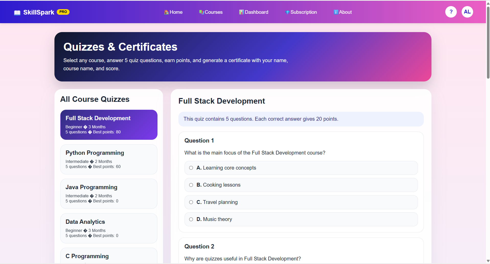
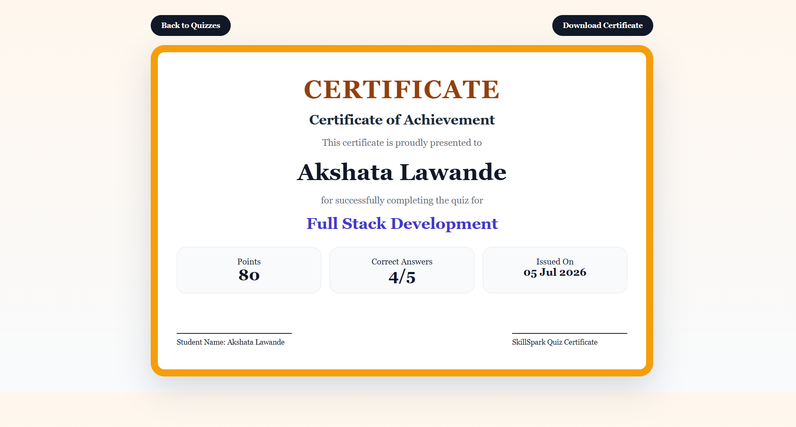
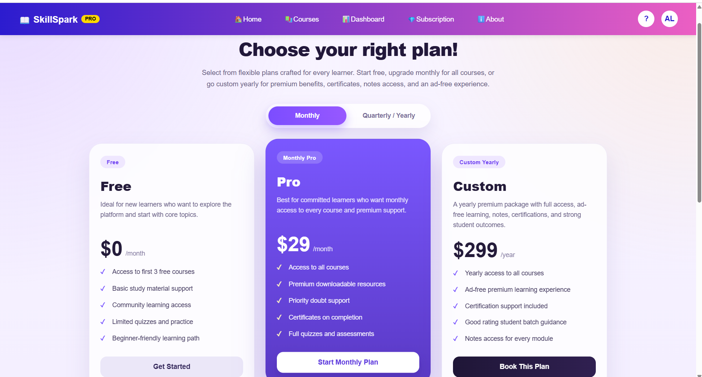

# 🎓 SkillSpark - Full Stack E-Learning Platform

SkillSpark is a Full Stack E-Learning Platform developed using PHP, MySQL, HTML, CSS and JavaScript.

It allows students to register, learn through video playlists, attempt quizzes, and download certificates after completing quizzes.

---

## 🚀 Features

- User Registration & Login
- Dashboard
- Free & Premium Courses
- Embedded YouTube Playlists
- Quiz System
- Automatic Score Calculation
- Download Certificate (PDF)
- Responsive UI
- MySQL Database

---

## 🛠 Technologies Used

- HTML5
- CSS3
- JavaScript
- PHP
- MySQL
- FPDF
- XAMPP

---

## 📷 Project Screenshots

### 🏠 Homepage



---

### 🔐 Login Page



---

### 📝 Registration Page



---

### 📚 Courses Page



---

### 📊 Dashboard



---

### ❓ Quiz Page



---

### 🏆 Certificate



---

### 💳 Subscription Page



---
## 🗄️ Database Setup

1. Open **phpMyAdmin**.
2. Create a new database named **skillspark**.
3. Import the file:

```
database/skillspark.sql
```

4. Start Apache and MySQL using XAMPP.
5. Open the project in your browser.

## 👩‍💻 Developed By
Akshata Lawande
